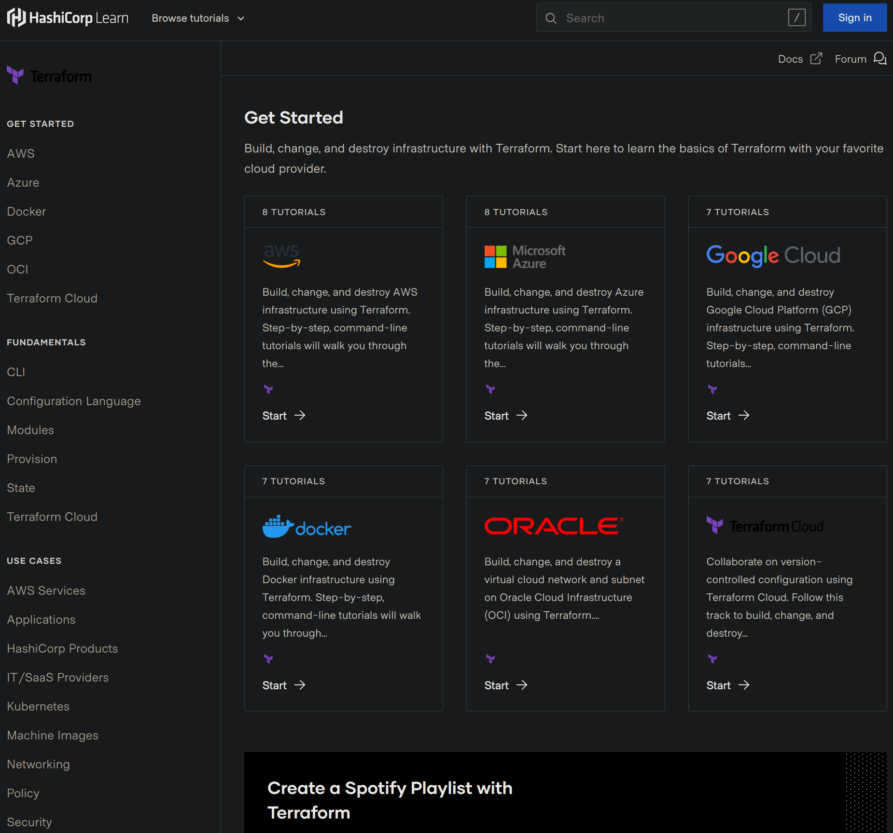

# Terraform Notes

## References

* [HashiCorp Learn - Teraform](https://learn.hashicorp.com/terraform) (MUST)

Starting point to learn Terraform.

### HCL

* [HashiCorp Learn - Teraform - Configuration Language](https://learn.hashicorp.com/collections/terraform/configuration-language)

### Use Cases

* [Manage Kubernetes with Terraform](https://learn.hashicorp.com/collections/terraform/kubernetes)